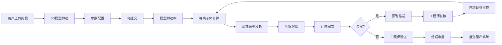

## 1. 产品概述

等离子体刻蚀工艺多尺度模拟与参数优化平台，为半导体制造工艺工程师提供从掩模版图到刻蚀形貌的全流程数字化仿真能力。平台集成三维建模、等离子体物理化学计算、实时监控预警、智能参数推荐和多级审批流程，助力提升工艺开发效率、降低实验成本。

- 核心用户：工艺工程师、技术经理、首席科学家
- 核心价值：数字化虚拟实验替代实体试片，缩短工艺开发周期50%以上

## 2. 核心功能

### 2.1 用户角色
| 角色 | 注册方式 | 核心权限 |
|------|----------|----------|
| 工艺工程师 | 企业账号登录 | 创建模拟任务、配置参数、监控计算、提交审核 |
| 技术经理 | 企业账号登录 | 审批工艺方案、确认工艺窗口、查看统计数据 |
| 首席科学家 | 企业账号登录 | 全局监控、批次管理、异常处理、系统配置 |
| 系统管理员 | 企业账号登录 | 用户管理、权限配置、系统维护 |

### 2.2 功能模块
1. **综合看板**：实时统计概览、工艺能力指数雷达图、预警通知中心
2. **任务管理**：任务列表、状态流转、详情查看、批量操作
3. **模拟工作台**：掩模上传、3D模型构建、参数配置、模拟控制
4. **实时监控**：刻蚀剖面角度、选择性、不均匀度实时监控与预警
5. **智能推荐**：历史数据分析、最优参数组合推荐、参数优化记录
6. **审批中心**：两级审批流程（工程师→经理）、审批记录追溯
7. **报告中心**：PDF综合报告生成、全场数据导出、历史报告管理
8. **批次管理**：批次任务管理、不均匀度监控、批次暂停/恢复

### 2.3 页面详情
| 页面名称 | 模块名称 | 功能描述 |
|----------|----------|----------|
| 综合看板 | 统计概览 | 今日完成率、速率偏差、优化次数等关键指标卡片 |
| 综合看板 | 雷达图 | 工艺能力六维指数雷达图展示 |
| 综合看板 | 预警列表 | 最新异常预警及处理状态 |
| 任务列表 | 任务筛选 | 按状态、批次、时间筛选任务 |
| 任务列表 | 任务卡片 | 显示任务状态、进度、关键参数 |
| 模拟详情 | 3D视图 | 刻蚀形貌三维可视化展示 |
| 模拟详情 | 监控曲线 | 角度、选择性、速率实时曲线图 |
| 模拟详情 | 参数面板 | 功率、气压、气体组份参数配置 |
| 智能推荐 | 参数推荐 | 基于历史数据的最优参数推荐 |
| 审批中心 | 待办列表 | 待审批任务列表及操作按钮 |
| 报告中心 | 报告预览 | 刻蚀轮廓、速率云图、粗糙度曲线展示 |
| 批次管理 | 批次监控 | 批次不均匀度趋势及暂停控制 |

## 3. 核心流程

用户上传掩模版图文件 → 系统自动识别图形构建三维刻蚀模型 → 初始化等离子体化学反应和离子输运参数 → 提交任务进入计算队列 → 模型构建→等离子体计算→刻蚀速率分析→形貌演化自动流转 → 实时监控剖面角度和选择性 → 异常触发预警推送工程师复核 → 复核通过自动调整参数重新模拟（记录调参次数） → 计算完成生成综合报告 → 工程师验证均匀性后提交经理审批 → 经理确认工艺窗口 → 推送至量产工艺系统

## 4. 用户界面设计

### 4.1 设计风格
- **主色调**：深海蓝 (#0F172A) 作为主背景，科技蓝 (#0EA5E9) 作为主色，电光青 (#06B6D4) 作为辅助色
- **强调色**：警示橙 (#F97316) 用于预警，成功绿 (#10B981) 用于正常状态
- **字体**：使用 Geologica 作为标题字体（科技感），Inter 作为正文字体（易读性）
- **按钮风格**：微圆角 (6px)、微妙渐变、悬停时有发光效果
- **布局风格**：深色工业控制面板风格，卡片式布局，数据密集型展示
- **图标风格**：Lucide 线性图标，配合科技感发光效果

### 4.2 页面设计概述
| 页面名称 | 模块名称 | UI元素 |
|----------|----------|--------|
| 综合看板 | 统计卡片 | 渐变背景、发光边框、数据动画、趋势箭头 |
| 综合看板 | 雷达图 | 半透明填充、霓虹描边、动态数据标签 |
| 任务列表 | 状态标签 | 胶囊状、发光边框、颜色编码状态 |
| 模拟详情 | 3D视图 | 深色背景、线框模型、截面切割、颜色映射 |
| 模拟详情 | 监控曲线 | 多色折线图、实时数据点、阈值参考线 |
| 参数面板 | 滑块控件 | 自定义轨道、发光滑块、数值实时显示 |
| 预警通知 | 通知卡片 | 左侧颜色条、脉冲动画、操作按钮 |
| 报告预览 | 图表区 | 高对比度曲线、云图配色、科学绘图风格 |

### 4.3 响应式
- 桌面端优先设计（1440px+），适配双屏工作站
- 侧边栏可折叠，主内容区自适应
- 关键监控区域支持全屏模式
- 触控优化：按钮最小尺寸40px，适合工业平板操作

### 4.4 可视化设计指引
- **3D刻蚀模型**：使用线框+半透明表面展示，支持X/Y/Z轴截面切割
- **速率云图**：使用蓝-青-黄-红渐变色谱，标注关键数值点
- **粗糙度曲线**：高采样率折线图，显示Ra/Rms统计值
- **状态流转**：时间轴式展示，当前状态高亮发光
- **工艺窗口**：二维等高线图，标记最佳工作点
