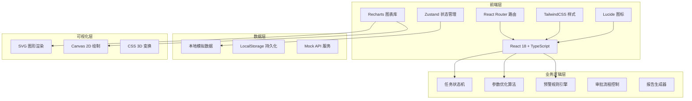
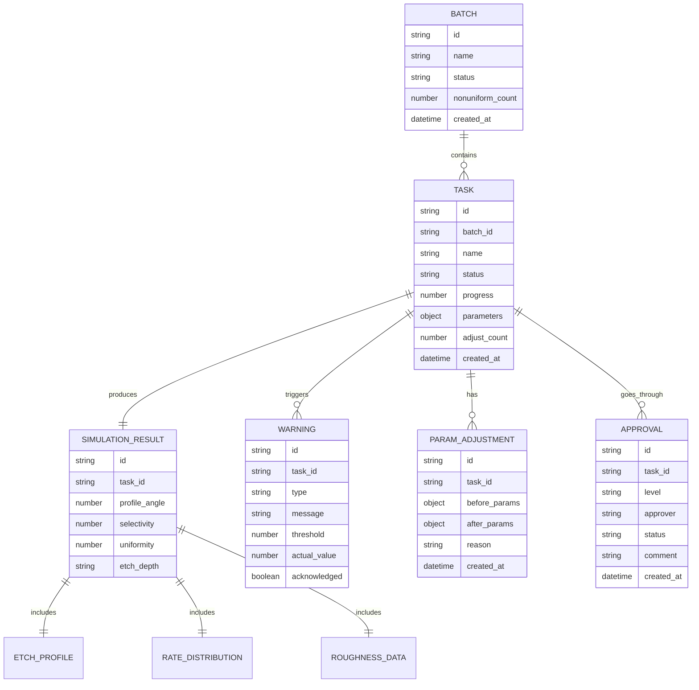

## 1. 架构设计



## 2. 技术描述
- **前端框架**：React@18 + TypeScript + Vite
- **状态管理**：Zustand（轻量级、支持中间件）
- **路由**：React Router DOM@6
- **样式方案**：TailwindCSS@3
- **图表可视化**：Recharts
- **图标库**：Lucide React
- **PDF生成**：jsPDF + html2canvas
- **后端**：纯前端Mock，使用本地数据模拟
- **数据持久化**：LocalStorage

## 3. 路由定义
| 路由 | 页面用途 |
|------|----------|
| /dashboard | 综合看板首页 |
| /tasks | 任务列表页 |
| /tasks/:id | 模拟任务详情页 |
| /tasks/create | 创建新模拟任务 |
| /approval | 审批中心 |
| /reports | 报告中心 |
| /batches | 批次管理 |
| /recommendation | 智能参数推荐 |

## 4. 数据模型

### 4.1 实体关系图



### 4.2 核心TypeScript类型定义

```typescript
// 任务状态枚举
type TaskStatus = 'pending' | 'model_building' | 'plasma_calculation' | 'rate_analysis' | 'profile_evolution' | 'completed' | 'error';

// 工艺参数
interface ProcessParams {
  rf_power: number;        // 射频功率 (W)
  bias_power: number;      // 偏压功率 (W)
  pressure: number;        // 气压 (mTorr)
  gas_ratio: {             // 气体组份
    Ar: number;
    CF4: number;
    O2: number;
  };
  temperature: number;     // 温度 (°C)
  time: number;           // 刻蚀时间 (s)
}

// 模拟结果
interface SimulationResult {
  profile_angle: number;       // 剖面角度 (°)
  selectivity: number;         // 选择性
  uniformity: number;          // 均匀度 (%)
  etch_depth: number;          // 刻蚀深度 (nm)
  etch_rate: number;           // 刻蚀速率 (nm/min)
  rate_distribution: number[]; // 速率分布
  roughness_curve: number[];   // 粗糙度曲线
  profile_coords: Array<{x: number, y: number}>; // 轮廓坐标
}

// 预警信息
interface Warning {
  id: string;
  taskId: string;
  type: 'angle_deviation' | 'selectivity_low' | 'nonuniformity_high';
  message: string;
  threshold: number;
  actualValue: number;
  acknowledged: boolean;
  createdAt: Date;
}

// 审批记录
interface ApprovalRecord {
  id: string;
  taskId: string;
  level: 'engineer' | 'manager';
  approver: string;
  status: 'pending' | 'approved' | 'rejected';
  comment: string;
  createdAt: Date;
}
```

## 5. 目录结构

```
src/
├── components/          # 通用组件
│   ├── layout/         # 布局组件
│   ├── charts/         # 图表组件
│   ├── forms/          # 表单组件
│   └── ui/             # 基础UI组件
├── pages/              # 页面组件
│   ├── Dashboard.tsx
│   ├── TaskList.tsx
│   ├── TaskDetail.tsx
│   ├── CreateTask.tsx
│   ├── Approval.tsx
│   ├── Reports.tsx
│   ├── Batches.tsx
│   └── Recommendation.tsx
├── store/              # Zustand状态管理
│   ├── useTaskStore.ts
│   ├── useApprovalStore.ts
│   └── useDashboardStore.ts
├── types/              # TypeScript类型定义
│   └── index.ts
├── utils/              # 工具函数
│   ├── simulation.ts   # 模拟计算工具
│   ├── report.ts       # 报告生成工具
│   └── optimization.ts # 参数优化算法
├── data/               # Mock数据
│   └── mockData.ts
├── hooks/              # 自定义Hooks
│   ├── useSimulation.ts
│   └── useMonitoring.ts
├── App.tsx
├── main.tsx
└── index.css
```
